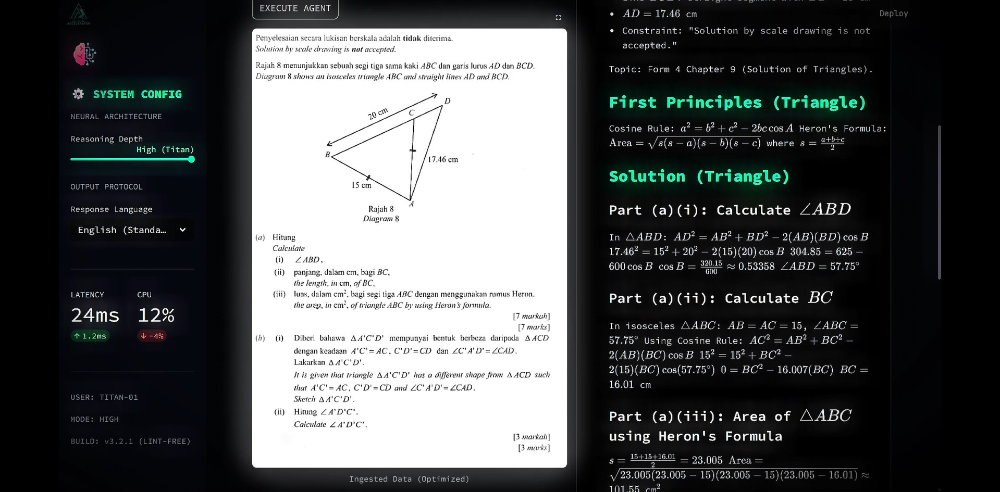

# ⚡ Nexus AI // The Reasoning Engine Template

[](https://streamlit.io)
[](https://openai.com/)
[](https://opensource.org/licenses/MIT)
[](https://share.streamlit.io)

> **"The University-Grade AI Wrapper."**
> A production-ready architecture to deploy GPT-4o with Vision, Real-time Streaming, and LaTeX Rendering.
> **Built for Hackathons & Final Year Projects.**

---

## 🎥 Capability Showcase
*The video below demonstrates **Sigma AI**, a production-grade implementation built using this exact architecture.*

<!-- PASTE YOUR GITHUB ISSUE VIDEO LINK OR YOUTUBE THUMBNAIL HERE -->
[](https://youtu.be/_cbe6P1pMdE)

---

## 🚀 What Is This?
This repository is a **clean, unbranded** template of the engine shown above. It provides the "Skeleton" you need to build advanced AI apps without starting from scratch.

### Core Features:
*   **🧠 Multi-Modal Vision:** Drag & Drop images, handwriting, or PDFs. The AI analyzes them instantly.
*   **⚡ Real-Time Streaming:** Text generates token-by-token (No "Loading..." spinners).
*   **🎨 Cyber-Minimalist UI:** Pre-styled CSS that looks professional out of the box.
*   **🧮 Academic Math Engine:** Automatically formats complex equations ($$ x = \frac{-b}{2a} $$) using LaTeX.
*   **🛡️ Public-Safe Auth:** Users must enter their own API Key, making it safe to demo publicly.

---

## 🛠️ How To Run (Do It Yourself)
*Prerequisites: Python 3.9+, OpenAI API Key.*

**1. Clone the Repo**
```bash
git clone https://github.com/Basyirin-AI/nexus-ai-template.git
cd nexus-ai-template
```

**2. Install Dependencies**
```bash
pip install -r requirements.txt
```

**3. Ignite the Engine**
```bash
streamlit run main.py
```

*The app will launch in your browser. Enter your API Key in the sidebar to start.*

---

## ⚖️ The "Done-For-You" Service
**Most students get stuck on deployment.**
Running it on `localhost` is easy. Deploying it to a live URL (`https://your-project.streamlit.app`) with custom branding and domain logic is hard.

I offer a **Rapid Prototyping Service** to bridge that gap.

| Feature | 🆓 Free Template (This Repo) | ⚡ Paid Service ($99 USD) |
| :--- | :---: | :---: |
| **Source Code** | ✅ Included | ✅ Included |
| **Hosting** | ❌ Localhost Only | ✅ **Live URL Deployment** |
| **Branding** | ❌ Default "Nexus" Theme | ✅ **Your Name/Logo/Colors** |
| **Custom Logic** | ❌ Generic AI Persona | ✅ **Tuned to your Topic (Law/Med)** |
| **Turnaround** | 🐢 Do It Yourself | 🚀 **< 48 Hours** |

### 💼 Who Is This For?
*   **Hackathon Teams** who need a backend *now* so they can focus on the pitch.
*   **FYP Students** who need a polished artifact to show their supervisor.
*   **Non-Technical Founders** validating an idea.

---

## 📬 Ready to Build?
I accept **2 clients per week** to ensure quality.

*   **Cost:** Flat Fee **$99 USD** (50% Deposit).
*   **Deliverable:** Full Source Code + Live Deployed URL.
*   **Time:** 48 Hours.

**[Click Here to DM on Twitter/X]** or email me at **[your.email@example.com]**.

---

<p align="center">
  <i>Built by <a href="https://github.com/Basyirin-AI">Basyirin | The AI Architect</a>.</i>
</p>
